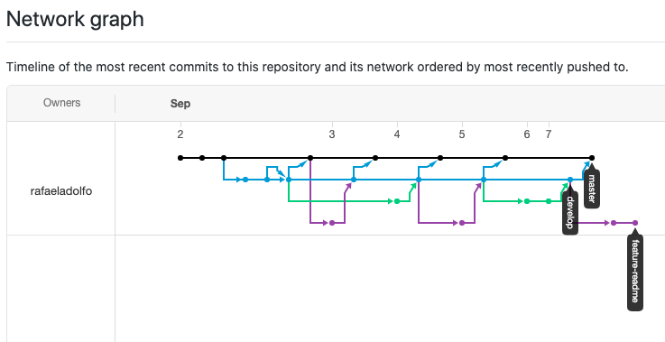
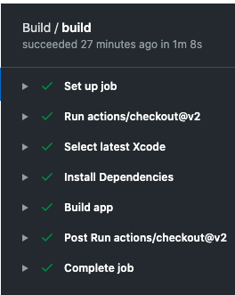

# FastNews

This repository contains the iOS test source code.

## Same project in SwiftUI GoTo: https://github.com/rafaeladolfo/FastNewsSwiftUI

### Stack
* Using UIKit 
* Pods

### Features
* Integration with reddit api
* News viewing
* Comments listing
* Url Sharing

### Git strategy
* Using gitflow to organize code commits
* Check the flow in network: https://github.com/rafaeladolfo/fastnews/network

* Feature branches:
.svg?cdnVersion=1224)

* Release branches:
.svg?cdnVersion=1224)

* Result:  

### Using CICD with github actions
* yml file: https://github.com/rafaeladolfo/fastnews/blob/master/.github/workflows/swift.yml
* result:  

